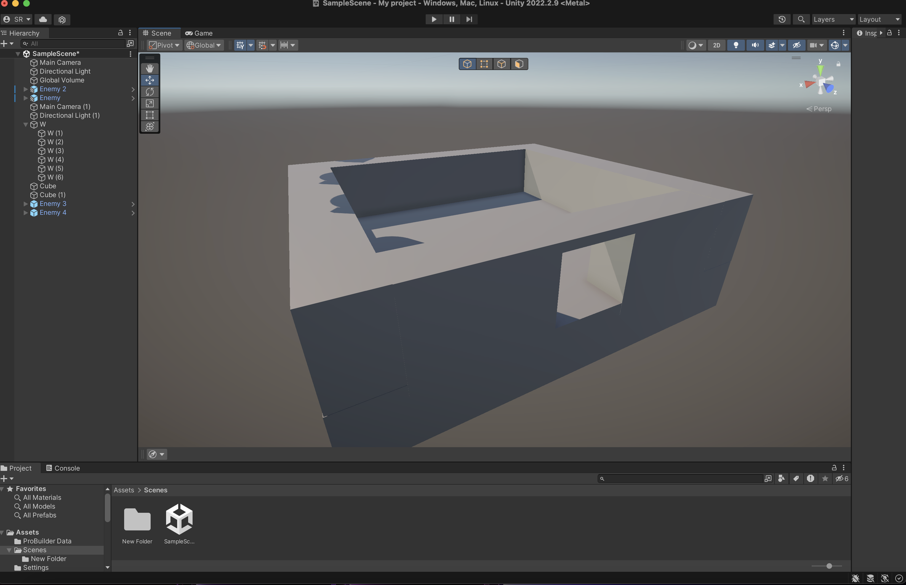

After creating the project in Unity hub, first I added a cube and built a basic house out of cubes.

After that, I added a cube and turned it into a ball and add physics. Then I added a ramp for the ball to roll down but there was a problem, the "ball" looked like a ball but it behaved like a cube.So i chnaged its physics to behave like an actual ball and roll down the ramp normally. 

n
