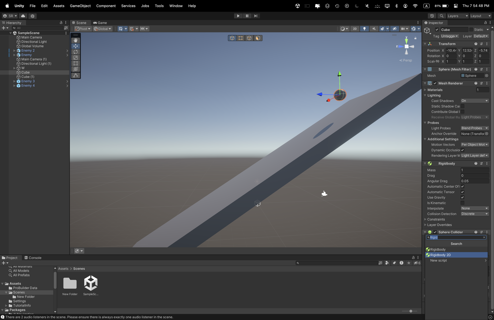
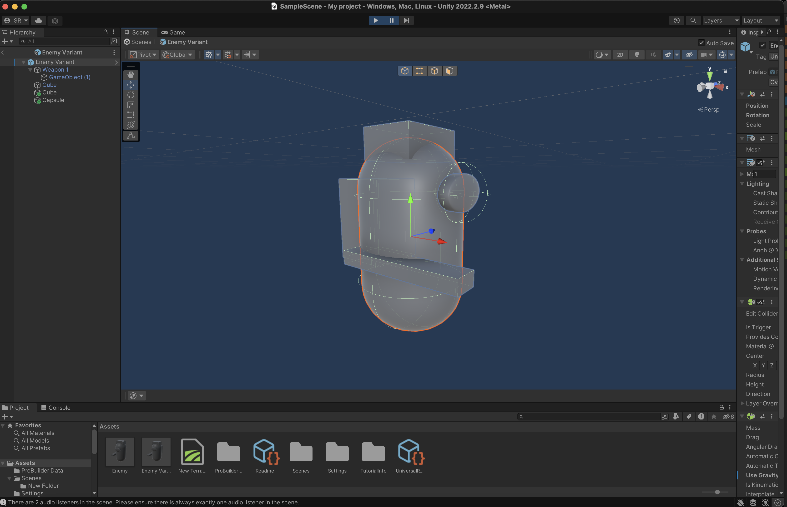
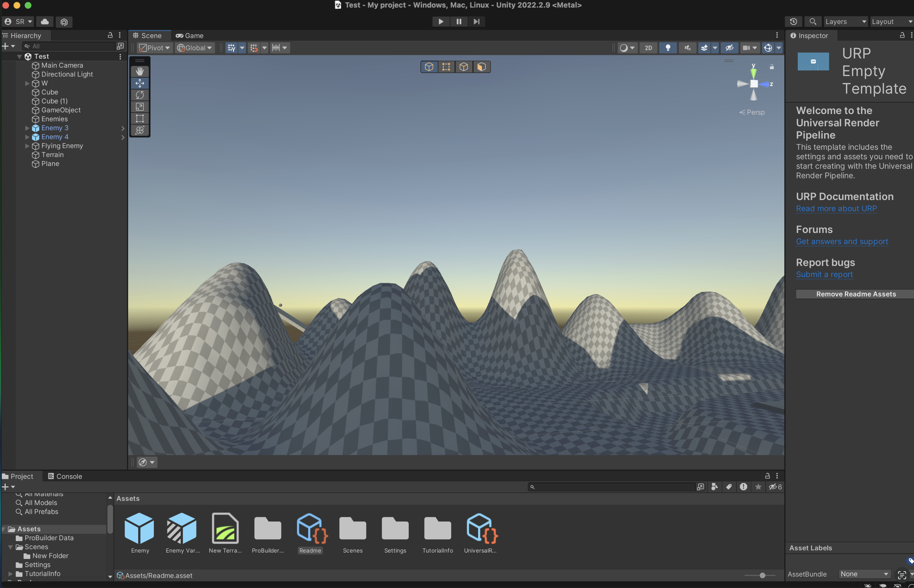

After creating the project in Unity hub, first I added a cube and built a basic house out of cubes.

After that, I added a cube and turned it into a ball and add physics. Then I added a ramp for the ball to roll down but there was a problem, the "ball" looked like a ball but it behaved like a cube.So i chnaged its physics to behave like an actual ball and roll down the ramp normally. 

Then I started adding some basic enemies using a capsule and a streched cube as it's weapon and then created another flying enemy with a jetpack and turn off tis gravity.

After dealing with the enemies, I added a terrain and changed its size, added some slopes and mountains and made it smoother.
 ((add mountains screenshot))
Then it was time to give some life to the enviroment by adding textures to the floor and the mountains! It was simple, I just had to go to the interent and searched up some grass and dirt textures and downloaded it into my computer and imported them into the Unity file explorer. I added the grass texture so everything was grass.

With the dirt texture I use the brush and painted the mountain with some dirt and added a little but of grass to make it look realistic. It turned out to look great! 
