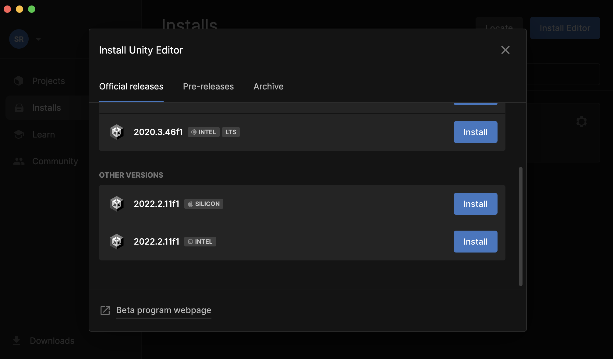
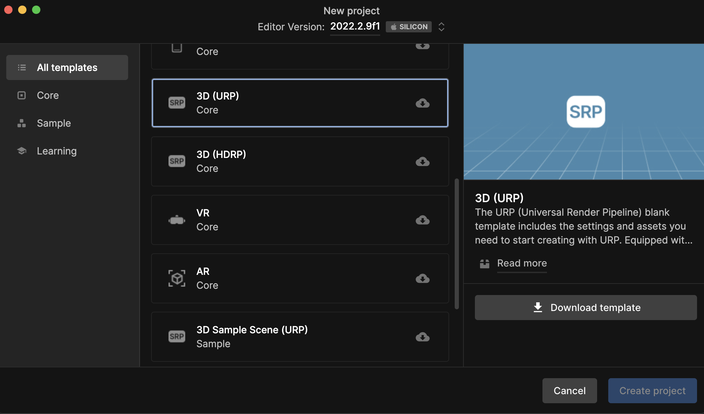

First, I went to https://unity.com/download to download & install Unity hub. In this case I'm using a Mac with an Apple Silicon M1 proccesor so I'll install the Mac verison (Apple Silicon).

 Unity hub lets you donwload any version of Unity but by default it donwloads the 2021 version but is recomended to download the latest version (in this case the 2022 version). 
 
 Unity hub also lets you manage your projects. For this prject, I created a 3D core(URP) project on the hub.
 
